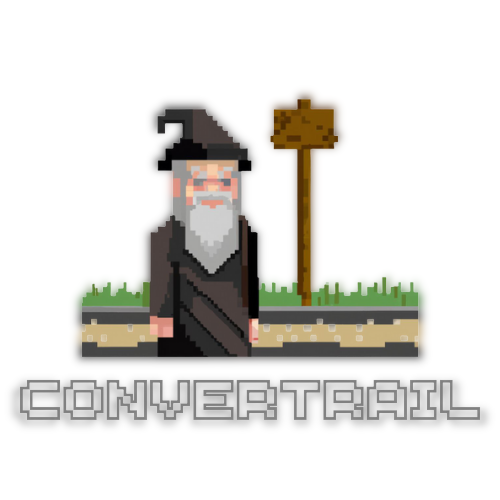
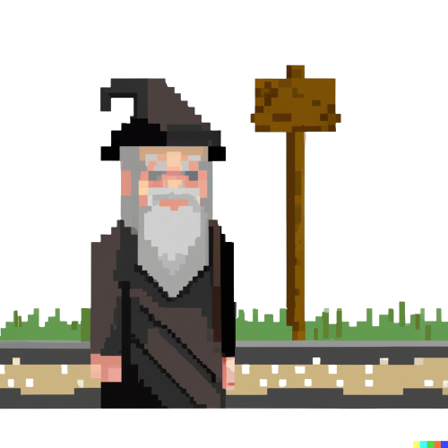

<br/>
<p align="center">
    
    <h1 align="center">Convertrail</h1>

  <p align="center">
      Un wizard conversor de archivos de CSV 🧙
    <br/>
    <a href="https://github.com/DanteZulli/convertrail">Documentación</a>
    .
    <a href="https://github.com/DanteZulli/convertrail/issues">Reportar Bugs</a>
    .
    <a href="https://github.com/DanteZulli/convertrail/issues">Solicitar features</a>
  </p>
</p>

<div align="center">

   

</div>

## Tabla de contenidos

- [Tabla de contenidos](#tabla-de-contenidos)
- [Sobre el proyecto](#sobre-el-proyecto)
- [Construido con](#construido-con)
- [Para empezar](#para-empezar)
  - [Prerrequisitos](#prerrequisitos)
  - [Que incluye este proyecto?](#que-incluye-este-proyecto)
- [Roadmap del proyecto](#roadmap-del-proyecto)
- [To-Do List](#to-do-list)
- [Contribuciones](#contribuciones)
  - [Creando un Pull Request](#creando-un-pull-request)
- [Licencia](#licencia)
- [Autor](#autor)
- [Otros Recursos que usé](#otros-recursos-que-usé)

## Sobre el proyecto

<div align="center">
    
</div>
<i><b>Convertrail</b></i> (un juego de palabras entre "convert" y "trail", que significa "conversor" y "camino" respectivamente) es un conversor de archivos CSV. Nació como un proyecto para la [Superintendencia de Seguros de la Nación](https://www.argentina.gob.ar/superintendencia-de-seguros), pero luego fue separado y se le fueron agregando funcionalidades (Así como cambiando de perspectiva) para que llegue a ser lo que es ahora.<br>
El proyecto apunta a ser una forma sencilla de convertir archivos CSV a otros formatos, como JSON (Actualmente el único formato disponible).<br>
Se intenta mantener el dinamismo y la versatilidad, utilizando un sistema de parseo que cambia dinámicamente según los datos que se le pasen.<br>
También posee un ApiController via <i>HttpClient</i> que se encarga de manejar las peticiones al servidor (por si se requiere consumir una API con los datos parseados), y un sistema de logs que se encarga de registrar los errores y las acciones que se realizan en el programa.<br>
El proyecto está en constante desarrollo, por lo que se irán agregando funcionalidades y mejorando el código con el pasar del tiempo.

## Construido con

<div align="center">
    
</div>
<br>
Este proyecto fue construido con las siguientes herramientas:

- [Java](https://www.java.com/es/download/) (Versión 17, aunque el código es compatible con versiones anteriores hasta Java 11)
- [SpringBoot](https://spring.io/projects/spring-boot) (Versión 3.1.1)
- [Maven](https://maven.apache.org/) (Versión 4.0.0, para manejar dependencias como GSON, Jackson, OpenCsv, etc)
- [OpenJDK](https://openjdk.java.net/) (Versión 17, para compilar el código)
- [VSCode](https://code.visualstudio.com/) (Como entorno de desarrollo, con todas las extensiones del pack de Java, las del pack de Spring y alguna que otra más)

Si necesitan saber sobre alguna otra herramienta que se haya utilizado, pueden preguntar en los [issues](https://github.com/DanteZulli/convertrail/issues).

## Para empezar

<div align="center">
    
</div>
<br>
Estas son las instrucciones para correr el proyecto en tu computadora local (A modo de ejemplo, esto no quiere decir que sea la única forma de correrlo).

1. Clonar el repositorio

```sh
git clone https://github.com/DanteZulli/quartz_scheduler.git
```

2. Asegurarse de tener instalado correctamente instalado Java 17.
3. Asegurarse de tener correctamente instalados todos los tools de OpenJDK 17 (O superior) y que estos se encuentren agregados al PATH (O que la ruta de acceso esté especificada en tu IDE).

```sh
openjdk version "17.0.7" 2023-04-18
OpenJDK Runtime Environment Temurin-17.0.7+7 (build 17.0.7+7)
OpenJDK 64-Bit Server VM Temurin-17.0.7+7 (build 17.0.7+7, mixed mode, sharing)
```

4. Importar el proyecto en tu IDE favorito (En mi caso, VSCode).
5. Crear una build del proyecto y correrlo.

### Prerrequisitos

- Java 17 (O superior)
- OpenJDK 17 (O superior)
- Maven 4.0.0 (O superior)
- VSCode (O cualquier otro IDE que soporte Java 17)
- Git (O cualquier otro software de control de versiones)
- Un poco de paciencia

### Que incluye este proyecto?

En general, esta es la estructura del proyecto. Se intentará mantener/modificar con el pasar del desarrollo, desde yá pido disculpas si no se encuentra actualizada.

```text
src/main/java/
└── ...convertrail/
    ├── api/
    │   ├── setup/
    |   |   └── Archivos de configuración de la API
    │   └── Archivos generales de la API
    |── csv/
    |   └── Archivos para el manejo de archivos CSV
    |
    └── ConvertrailApplication.java
csv_pruebas/
└── Archivos CSV varios a modo de pruebas/referencias
json_output/
└── Archivos JSON generados a partir de los
CSV de la carpeta csv_pruebas
```

## Roadmap del proyecto

Podés revisar los [open issues](https://github.com/DanteZulli/convertrail/issues) para ver una lista de las features propuestas (y los bugs conocidos).

## To-Do List
- [ ] Migrar a REST el ApiController. (Actualmente es un simple HttpClient).
- [ ] Agregar soporte para otros formatos de archivos (XML, YAML, etc).
- [ ] Configurar correctamente el sistema de logs (Con log4j2).
- [ ] Crear algún tipo de interfaz gráfica para el usuario.
- [ ] Agregar soporte para archivos comprimidos (ZIP, RAR, etc).
- [ ] Agregar soporte para archivos encriptados (AES, RSA, etc).
- [ ] Agregar soporte para archivos de texto plano (TXT, DOC, etc).
- [ ] Desarrollar un sistema de tests para el proyecto (JUnit, Mockito, etc).
- [ ] Mejorar la estructura del proyecto (Separar en módulos, etc).
- [ ] Sintetizar el código (Reducir la cantidad de líneas, etc).
- [ ] Estandarizar el código (Aplicar buenas prácticas, etc).

Entre otras cosas que se irán agregando con el pasar del tiempo.
## Contribuciones

Las contribuciones son lo que hacen que la comunidad open source sea un lugar tan increíble para aprender, inspirarse y crear. Cualquier contribución que hagas es **muy apreciada**. :D

- Si tenes sugerencias para mejorar o modificar el proyecto, podés [abrir un issue](https://github.com/DanteZulli/convertrail/issues/new).
- Si queres contribuir directamente, podes hacer un fork del proyecto, crear una branch con tus cambios y luego hacer un pull request.

### Creando un Pull Request

1. Hacé un Fork del proyecto
2. Creá tu propia branch (`git checkout -b feature/AmazingFeature`)
3. Hacé un commit con tus cambios (`git commit -m 'Add some AmazingFeature'`)
4. Hacé un push (`git push origin feature/AmazingFeature`)
5. Abrí un Pull Request

## Licencia

Distribuído bajo la licencia [MIT](https://opensource.org/license/mit/). Ver [LICENSE](https://github.com/DanteZulli/convertrail/LICENSE.md) para más información

## Autor

- **Dante Zulli** - [Github](https://github.com/DanteZulli) - _Todos mis proyectos_

## Otros Recursos que usé

- [Othneil Drew](https://github.com/othneildrew/Best-README-Template) (Para el template del Readme)
- [ImgShields](https://shields.io/) (Para los badges)
- [Dall-E](https://openai.com/blog/dall-e/) (Para esos maguitos facheros)
